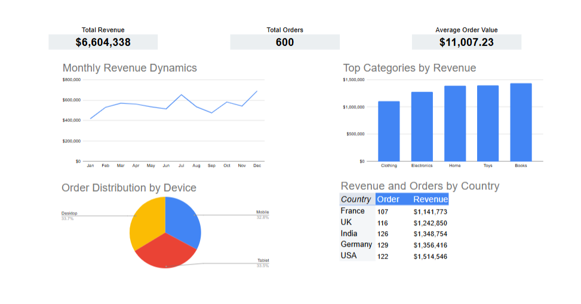

# ecommerce-analysis

# 📊 E-commerce Sales Performance Analysis (Google Sheets & BigQuery)

## Overview
This project analyzes e-commerce transactional data to identify key revenue drivers, customer behavior patterns, and product performance.

The analysis combines data cleaning, SQL-based exploration, KPI calculation, and an interactive dashboard.

## Context
The objective of this project was to explore transactional data (600 orders) and answer key business questions:
- How does revenue change over time?
- Which product categories generate the most revenue?
- Which markets and customer segments are the most valuable?
- What insights can support business growth and strategy?

## Data
Dataset: E-commerce transactions

Size: 600 orders

Key fields:
  - Order Date
  - Revenue
  - Product Category
  - Country
  - Device Type

Data preparation included:
- Fixing data types (dates, numeric values)
- Handling missing values
- Removing inconsistencies

## Process
1. Data Cleaning (Google Sheets)
- Standardized formats for dates and revenue
- Validated dataset consistency
- Prepared clean dataset for analysis
2. Exploratory Data Analysis (EDA)
- Analyzed revenue distribution and trends
- Identified seasonal patterns
- Explored category and country performance
3. SQL Analysis (BigQuery)
- Used aggregations and GROUP BY
- Built queries for:
  - Revenue trends (time series)
  - AOV calculation
  - Revenue by category and country
  - Customer segmentation

📌 All queries are available in queries.sql

4. Data Visualization (Dashboard)

Built an interactive dashboard in Google Sheets:
  - Monthly revenue dynamics
  - Top categories by revenue
  - Revenue and orders by country
  - Device distribution

## Results
*Total Revenue*: $6,604,338

*Total Orders*: 600

*Average Order Value (AOV)*: $11,007

Key insights:

- Revenue shows a steady upward trend with a strong seasonal peak in December
- Top-performing categories: Books, Toys, Home
- Highest revenue markets: USA, Germany, India
- Device usage is evenly distributed (~33% per device), indicating strong multi-channel engagement

## Dashboard Preview
🔗 (https://docs.google.com/spreadsheets/d/1oPjqZkJqP0049X0zswda4GMAv8w_3GFXXflEqJ4R7oE/edit?usp=sharing)

Preview: 

## Skills Demonstrated
SQL • Data Analysis • KPI Analysis • Data Cleaning • Data Visualization • Business Thinking
